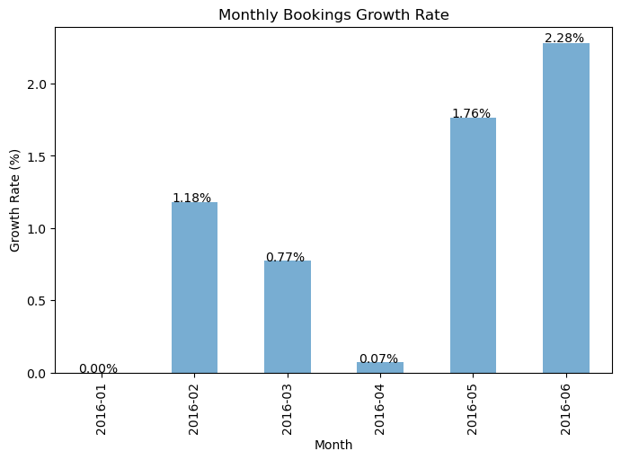
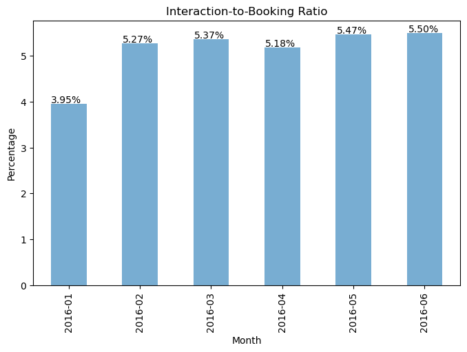

# Airbnb Take Home Challenge: Data Science - Analytics 

## Metrics

### 1. Monthly Bookings Growth Rate

The Monthly Bookings Growth Rate is a metric used to measure the percentage change in bookings from one month to the next. It provides insights into the month-over-month performance of a business or a specific product/service in terms of the number of bookings made. This metric is particularly relevant for businesses with a recurring or cyclical nature, as it helps assess the short-term growth or contraction in demand.

Holt's Exponential Smoothing (ETS) model is a time series forecasting method that includes components for the level and trend. It's useful when dealing with time series data that exhibits both a general level and a trend over time. The need for using Holt's ETS model to calculate the trend component and subsequently derive the Monthly Bookings Growth Rate is grounded in its ability to capture and project these underlying patterns in the data, this offers a more stable and meaningful metric for assessing the month-over-month changes in bookings.

The Monthly Bookings Growth Rate is calculated based on the trend component using the formula:

``Monthly Bookings Growth Rate = (Estimated Bookings in Previous Month - Estimated Bookings in Current Month) / Estimated Bookings in Previous Month × 100``

Where:

**Estimated Bookings in Current Month:** The total number of bookings made in the current month.
**Estimated Bookings in Previous Month:** The total number of bookings made in the month immediately preceding the current month.

**Interpretation:**

- A positive growth rate indicates an increase in bookings from the previous month, suggesting business growth or heightened demand.
- A negative growth rate indicates a decrease in bookings from the previous month, suggesting a decline in demand or business contraction.
- A growth rate of zero indicates no change in bookings from the previous month.

#### Previous months Bookings Growth Rate

### 2. Interaction-to-Booking Ratio

The Interaction-to-Booking Ratio is a metric used to measure the efficiency and effectiveness of a sales or booking process. It represents the proportion of customer interactions or inquiries that result in confirmed bookings. This metric is particularly relevant for evaluating how effective the platform is in facilitating guest/host communication through inquiries or other forms of contact.

We want to assess how well the platform is converting these interactions into actual bookings.

Here's how you can define the Interaction-to-Booking Ratio:

``Contact-to-Booking Ratio = (Number of Interactions / Number of Bookings ) × 100``

#### Previous months Interaction-to-Booking Ratio

